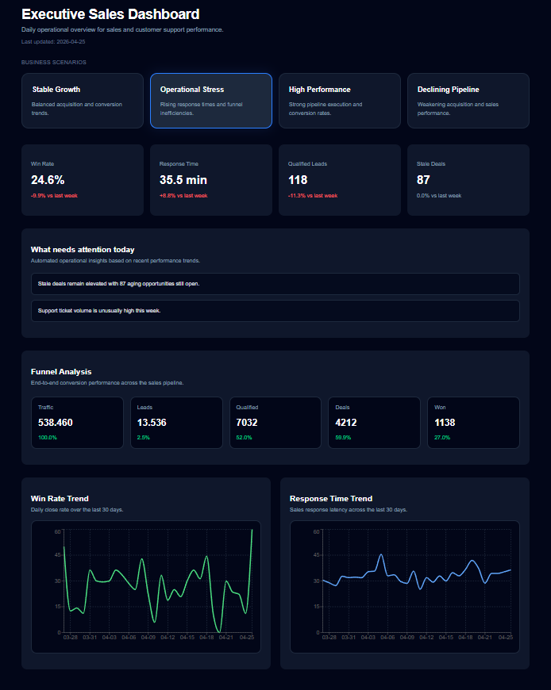

# Executive Sales Dashboard



Executive operational dashboard built for a B2B SaaS sales organization.

The application helps sales leadership quickly identify performance trends, operational bottlenecks, and areas requiring immediate attention across multiple business scenarios.

---

## Running Locally

### Docker

```bash
docker compose up --build
```

Application available at:

http://localhost:4173

---

### Local Development

```bash
npm install
npm run dev
```

Application available at:

http://localhost:5173

---

## Technical Decisions

### React + TypeScript
Chosen for scalability, strong typing, and maintainability.

### Vite
Used for fast development experience and lightweight builds.

### TailwindCSS
Selected for rapid UI iteration and consistent styling.

### Recharts
Used for lightweight and composable executive-focused visualizations.

### Selector-Based Architecture
Business logic and operational insights are separated from UI components through selectors, improving maintainability and testability.

### Dockerized Environment
The entire application runs inside Docker to ensure reproducible environments and simplified setup.

### Scenario-Based Dataset Navigation
Datasets were presented as business scenarios instead of technical labels to improve executive readability and user experience.

### Executive-Focused UX
The dashboard prioritizes quick decision-making through concise KPIs, operational insights, funnel visibility, and trend monitoring.

---

## Features

- Multi-dataset navigation
- Executive KPI summary cards
- Operational insight engine
- Funnel conversion analysis
- Trend visualizations
- Responsive layout
- Loading and empty states
- Dockerized setup

---

## Project Structure

```txt
src/
├── components/
│   ├── charts/
│   ├── dashboard/
│   ├── insights/
│   └── ui/
├── features/
│   └── metrics/
│       ├── constants/
│       ├── selectors/
│       ├── services/
│       ├── types/
│       └── utils/
├── pages/
```

---

## Second Iteration

Given additional time, the next improvements would include:

- API/backend integration
- Historical period comparison
- Automated anomaly detection
- Unit and integration testing
- Accessibility improvements
- Advanced filtering capabilities
- Executive alert prioritization
- Exportable executive reports
